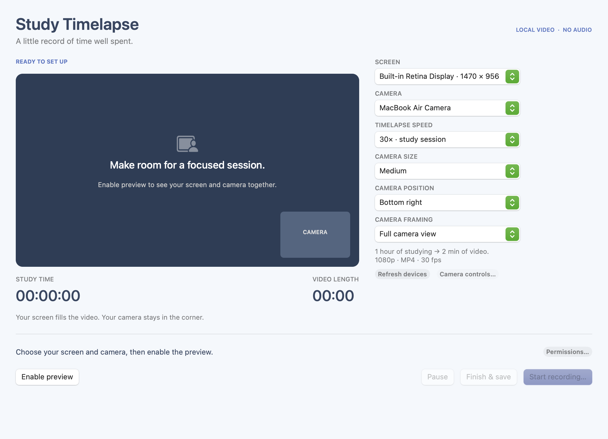

# Study Timelapse

I wanted to record study-with-me videos with my screen and my Mac's front camera in the same timelapse. Study Timelapse puts both views into one video, with the camera in a corner you can move and resize.

It's a native macOS app written in Swift. Recordings stay on your Mac.

[Download v0.2.0](https://github.com/Gabriel-Labariento/study-timelapse/releases/tag/v0.2.0) · [Report a bug](https://github.com/Gabriel-Labariento/study-timelapse/issues/new?template=bug_report.yml) · [MIT license](LICENSE)



## What it does

- Records one display with a mirrored camera inset.
- Lets you choose the inset's size, corner, and framing before recording.
- Shows the full camera image by default, with an optional 4:3 crop.
- Speeds up both views at 10×, 30×, or 60×.
- Pauses for breaks without adding that time to the video.
- Saves a silent 1080p MP4 at 30 fps.

| Speed | A one-hour session becomes |
| --- | --- |
| 10× | 6 minutes |
| 30× | 2 minutes |
| 60× | 1 minute |

The screen fits inside the video without cropping. The app's own window is excluded from the recording. There are no accounts, uploads, analytics, or microphone capture.

## Install

You'll need macOS 15 or later. The downloadable build is for Apple silicon Macs.

1. Download `Study-Timelapse-macOS-arm64.zip` from the [release page](https://github.com/Gabriel-Labariento/study-timelapse/releases/tag/v0.2.0).
2. Unzip it and move `Study Timelapse.app` to Applications.
3. Open the app.

The app is ad-hoc signed and isn't notarized with Apple. macOS may block the downloaded build. If you trust this release, use the app-specific Open Anyway option in System Settings > Privacy & Security, or [build it from source](#build-from-source). You don't need to disable Gatekeeper.

This is an early release. Automated timing and video-export checks pass, but live permission flows, interruptions, and long recording sessions still need more testing. Try a short recording before using it for a full study session.

## Record a session

1. Choose your screen, camera, speed, inset size, corner, and framing.
2. Click **Enable preview** and allow camera and screen recording access when macOS asks.
3. Check that both views look right, then click **Start recording…** and choose where to save the video.
4. Use **Pause** and **Resume** when you take a break.
5. Click **Finish & save**. **Show saved video** opens the file's location in Finder.

Preview doesn't save anything. Finishing a recording turns capture off. While paused, the live preview stays on, but the paused time is left out of the video.

If you choose an existing filename, the app asks before replacing it. It keeps the old file until the new video has finished successfully.

## Camera framing

**Full camera view** keeps the whole image supplied by the camera. **Crop to 4:3** uses the tighter framing from the first release. With a 16:9 camera feed, full view restores the sides that the old crop cut off.

After enabling preview, **Camera controls** opens macOS's video effects controls. On supported Macs, turn off Center Stage and use the native zoom controls to widen the view. Available zoom levels depend on your camera and macOS; the app doesn't simulate a 0.5× lens. See [Apple's framing instructions](https://support.apple.com/en-us/105117#manual).

## Power use

The app schedules work around the next frame instead of checking 100 times a second. It draws previews at preview size and stops drawing them when the window is hidden, minimized, or fully covered. Recording continues at the chosen speed, with the same 1080p output. The camera and screen capture stay active.

A synthetic benchmark showed less preview processing work on an M4 MacBook Air. Battery savings haven't been measured. See the [measurements and test method](docs/performance.md).

## Permissions and interruptions

If access is denied, open System Settings > Privacy & Security and enable Study Timelapse under Camera and Screen & System Audio Recording. Reopen the app if macOS asks you to. The screen permission's name includes audio, but this app records no sound.

Keep the Mac unlocked and its display awake while recording. Active recording prevents automatic system sleep. A lock, display sleep, manual sleep, disconnected source, or capture error stops the session, and the app tries to save the completed portion.

Use Finish & save before closing your laptop. A force quit, power loss, or full disk can leave a recording that can't be recovered. If the video finishes but can't be moved to your chosen destination, the error message gives you the temporary file's location.

## Build from source

You'll need Swift 6 or later through Xcode or Apple's Command Line Tools. The app uses Apple frameworks and has no third-party package dependencies.

```sh
git clone https://github.com/Gabriel-Labariento/study-timelapse.git
cd study-timelapse
./build.sh
open "Study Timelapse.app"
```

The script builds for your Mac's architecture and creates both an app bundle and a ZIP. It signs and verifies the app in a temporary directory so synced folders can't add Finder metadata during packaging. Keep the installed app in one place after granting permissions; moving or rebuilding it may require granting access again.

## Run the checks

```sh
./check.sh
```

The checks cover timing, pause behavior, layout, file replacement consent, encoder failures, and actual MP4 encoding and decoding. They use standalone executables, so XCTest isn't required.

You can also check the packaged app's exporter without accessing your screen or camera. Choose a filename that doesn't already exist:

```sh
"Study Timelapse.app/Contents/MacOS/StudyTimelapse" \
  --verify-export /tmp/study-timelapse-check.mp4
```

That command creates and decodes a three-second synthetic video. [Testing notes](docs/testing.md) describe the checks and what still needs testing on a real session.

## How it's built

AppKit handles the interface. ScreenCaptureKit captures the display, AVFoundation captures the camera and writes the MP4, and Core Image combines the frames.

The recording loop samples both sources using one clock. At 30×, it writes one frame per second of study time and plays those frames back at 30 fps. It keeps only the latest source frames and a bounded set of output buffers in memory.

| Folder | Contents |
| --- | --- |
| `Sources/TimelapseCore` | Timing, layout, session state, and file policies |
| `Sources/TimelapseMedia` | Capture, composition, recording, and video export |
| `Sources/StudyTimelapse` | AppKit interface and session controls |
| `Tests` | Core, media, and recording-engine checks |

## Contributing

Bug reports and pull requests are welcome. Include your macOS version and the steps that caused the problem. For a larger change, open an issue first so we can discuss the scope. See [CONTRIBUTING.md](CONTRIBUTING.md) for the development workflow.

## License

[MIT](LICENSE). Copyright 2026 [Gabriel Matthew Labariento](https://github.com/Gabriel-Labariento).
